# Ross Tax Pro Masterfile Platform

Ross Tax Pro Masterfile Platform is the documentation and operations hub for **Ross Tax Pro Software Co.** It organizes client masterfile records, tax-year workflows, MongoDB sync, transcript workflow design, reconciliation, notice tracking, ERO gateway activity, transaction-code analysis, and universal print packet generation.

<Note>
  This documentation app explains the platform and operating workflows. Protected taxpayer operations must run through secured backend services with authorization, audit logging, and environment-managed secrets.
</Note>

---

## What This Platform Helps You Do

<CardGroup cols={2}>
  <Card title="Client Masterfile" icon="users">
    Manage client-level records with masked identifiers, tenant-scoped access, import history, and lifecycle status.
  </Card>

  <Card title="Tax-Year Masterfile" icon="calendar-days">
    Track each client by tax year, including return status, transcript status, notice status, reconciliation status, and print packet readiness.
  </Card>

  <Card title="MongoDB Sync" icon="database">
    Sync client records, tax-year records, notices, transcript metadata, withholding records, workpapers, recommendations, and audit events into MongoDB.
  </Card>

  <Card title="TDS Worker Design" icon="server">
    Queue authorized transcript pull jobs through backend-only services with taxpayer authorization and vault-managed credentials.
  </Card>

  <Card title="Reconciliation" icon="scale-balanced">
    Compare return records, transcript records, withholding, credits, payments, notices, refund events, offsets, and adjustments.
  </Card>

  <Card title="Universal Print Packets" icon="print">
    Generate structured review packets with summaries, variance reports, evidence indexes, recommendations, and audit traces.
  </Card>
</CardGroup>

---

## Core Workflow

```mermaid
flowchart LR
  A[Import Client Data] --> B[Create Client Masterfile]
  B --> C[Create Tax-Year Records]
  C --> D[Queue Authorized Transcript Pull]
  D --> E[Normalize Transcript Transactions]
  E --> F[Run Reconciliation]
  F --> G[Generate Recommendations]
  G --> H[Create Universal Print Packet]
  H --> I[Reviewer Approval]
  I --> J[Archive Audit Trace]
```

